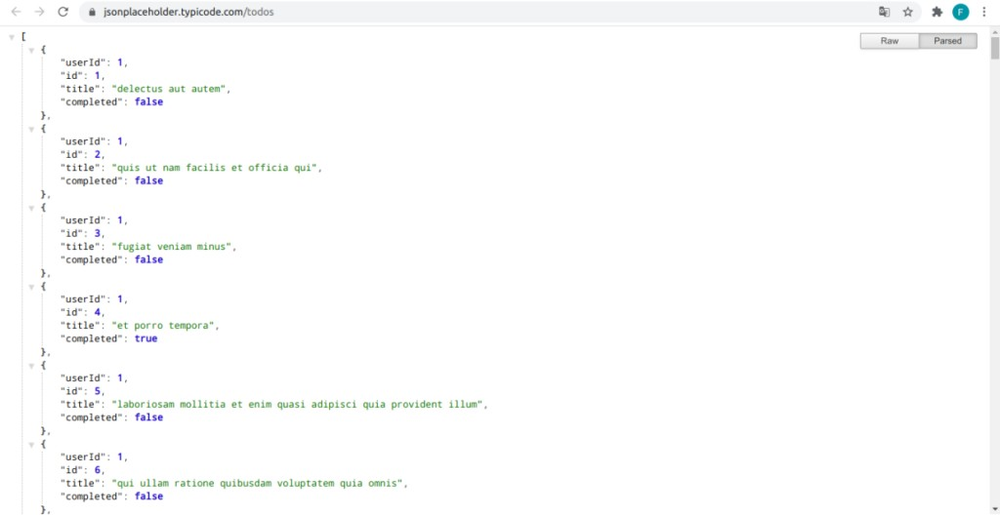
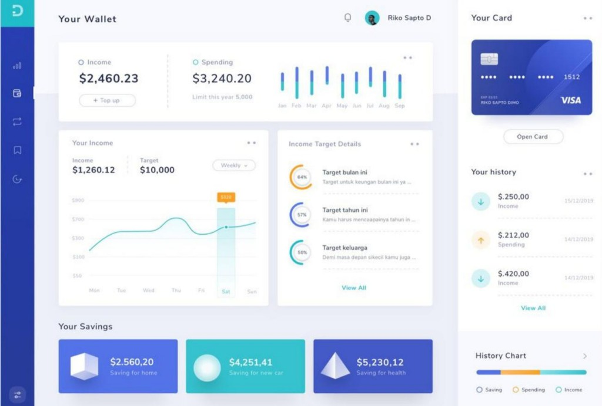
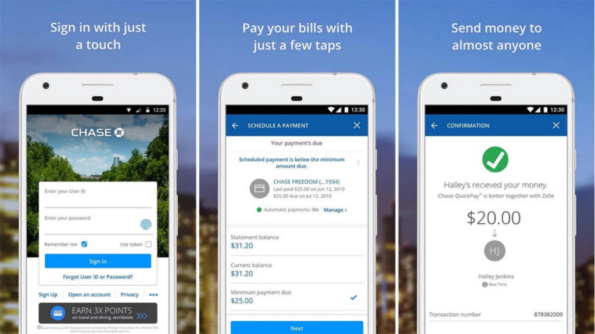

# Departemen Litbang Bidang Developer

## Task
Buatlah project dengan memilih minimal salah satu BAGIAN/STACK berikut :
- Back-end web service
- Front-end website
- Front-end mobile apps

TEMA dari project wajib memilih salah satu dari:
- Manajemen Perpustakaan
- Manajemen Keuangan
- E-Learning

Ketentuan :
- Dikerjakan secara individu. 
- Fitur-fitur yang dibuat bebas dan sesuai kreativitas dengan syarat harus sesuai tema yang dipilih
- Bahasa pemrograman yang digunakan bebas (disarankan JS untuk back-end)
- Mematuhi aturan lisensi apabila menggunakan kode sumber eksternal
- Bebas menggunakan framework/library (disarankan React untuk FE, Express untuk BE, dan React Native untuk mobile)

Pengumpulan : 
- Project diupload ke github/gitlab dengan repository public dan dipresentasikan saat tes wawancara
- Pengumpulan form berikut https://forms.gle/HWVaiRDFLnrufk9n9

---

Contoh Back-end web service

Contoh Front-end website

Contoh Front-end mobile apps

